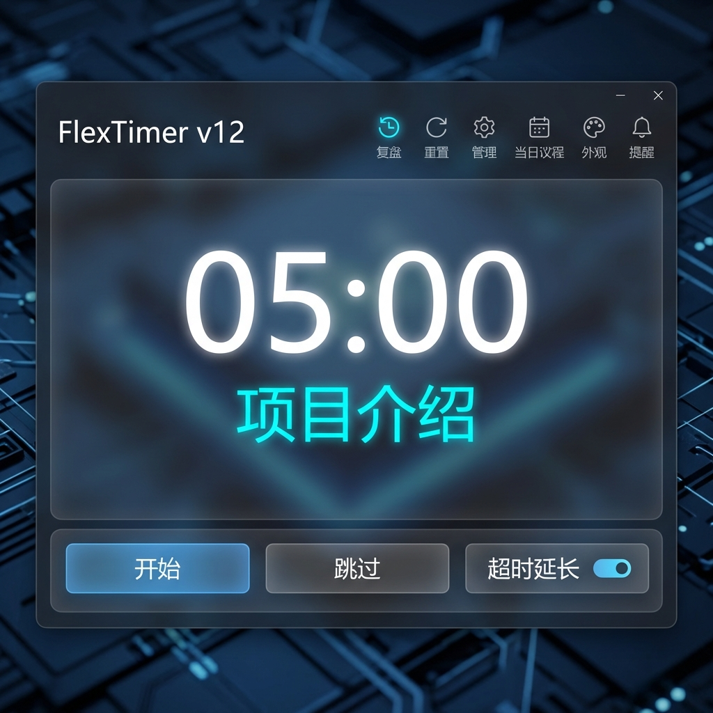
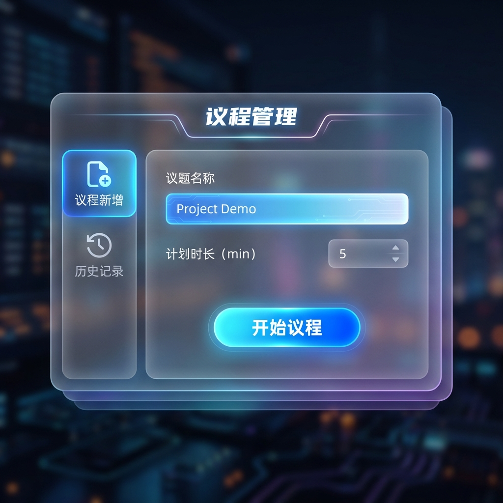
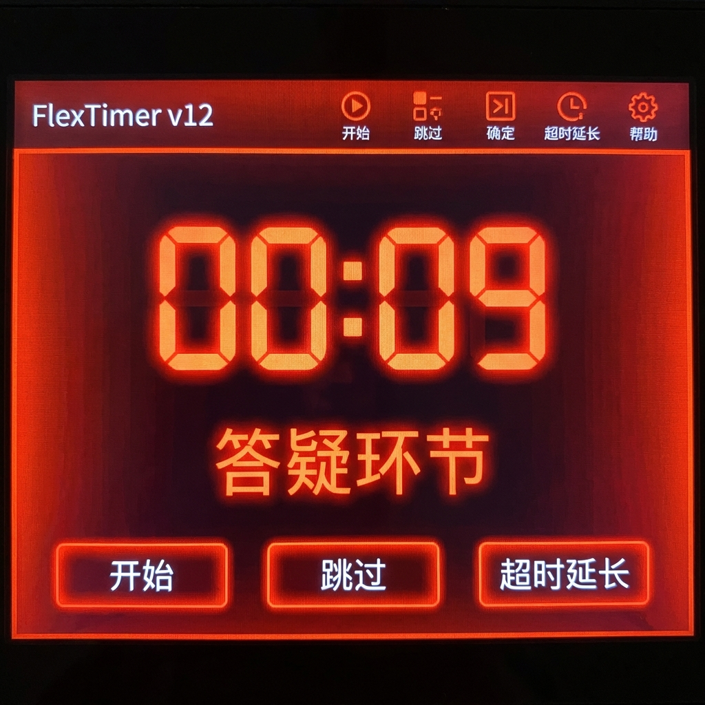
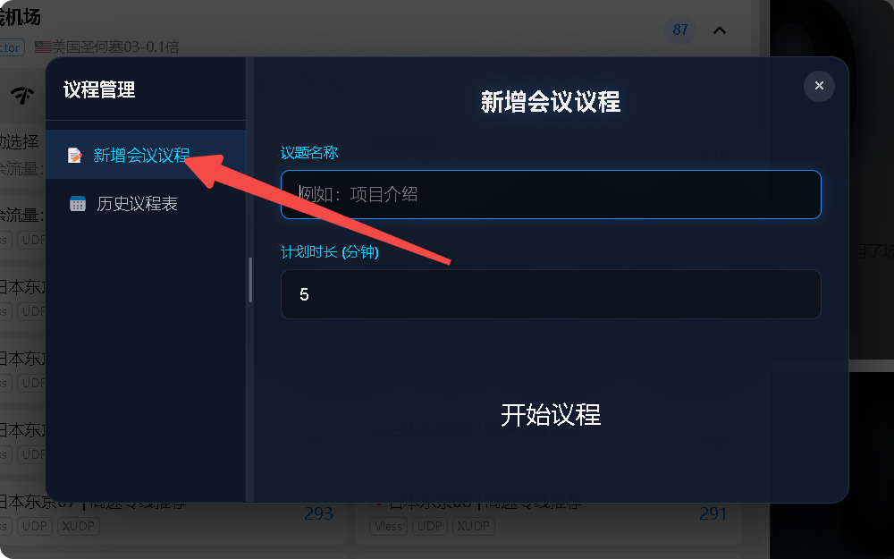
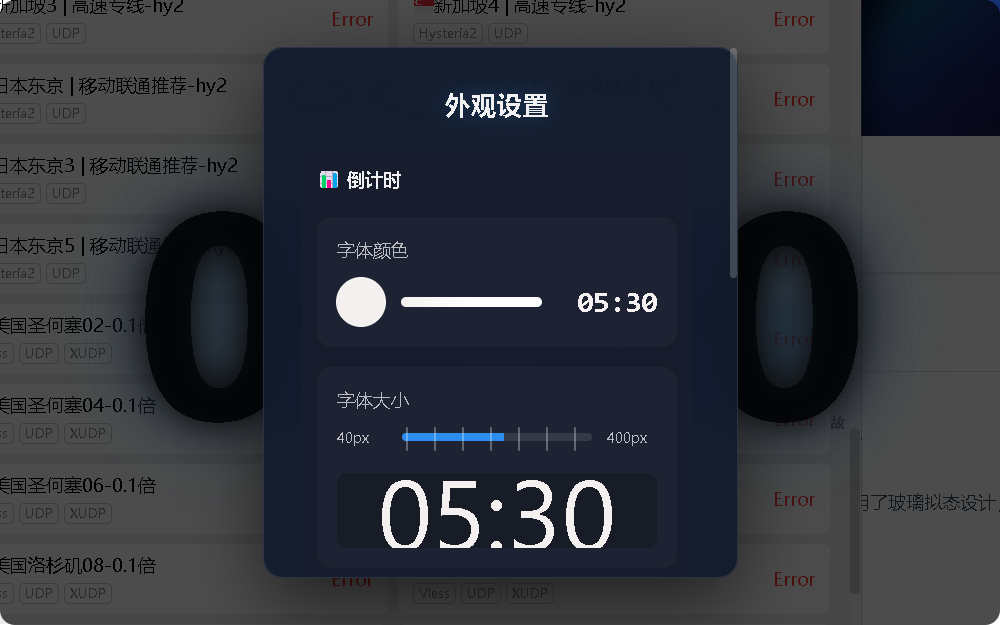
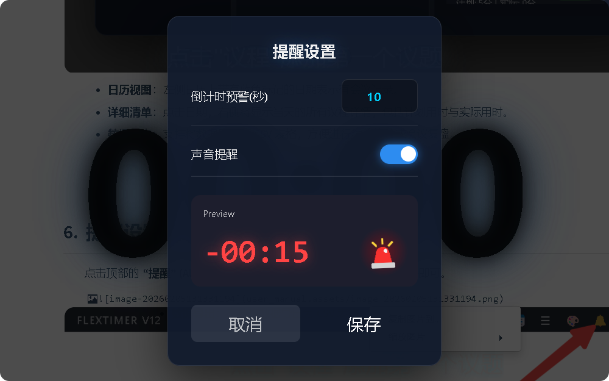

# FlexTimer v12 🚀

> **专业级会议与演示倒计时管理工具** —— 采用现代玻璃拟态 (Glassmorphism) UI 设计，为您提供无与伦比的视觉体验与极致的操作流畅感。

[](https://github.com/18585307051/FlexTimer-v12)


---






FlexTimer v12 是一款专为演讲者、会议主持人和教育工作者设计的计时器工具。它不仅是一个简单的倒计时器，更是一个集成了议程管理、历史回顾和外观自定义的全面会议助手。

## ✨ 核心特性

- 💎 **精美视觉**：深度定制的玻璃拟态 UI，支持磨砂背景、平滑阴影和动态微交互。
- 📅 **议程管理**：支持多环节录入、实时拖拽排序，计时过程中亦可自如调整。
- 🕒 **智能计时**：
  - **3-2-1 准备倒计时**：全屏沉浸式动画，消除演讲紧张感。
  - **超时负计时**：精确追踪超时时间，以红色警示提醒。
  - **超时延长开关**：灵活控制是否自动进入下一环节。
- 🛠️ **高度自定义**：自由调节字体大小、颜色及窗口透明度，适配任何背景（如 PPT、视频）。
- 📊 **历史与复盘**：
  - **日历管理**：按日期查看历史会议议程。
  - **CSV 导出**：一键生成复盘报告，提升会议效率。
- 🚀 **性能卓越**：基于 Electron 构建的原生体验，极低资源占用。

## 📸 主要界面预览

| 主计时界面 | 历史复盘 |
| :---: | :---: |
|  |  |
| 新增议程 | 外观设计 |
|  |  |
| 倒计时告警设置 | 超时预警 |
|  |  |

## 🛠️ 技术栈

- **Core**: HTML5, CSS3, ES6+ JavaScript
- **Framework**: [Electron](https://www.electronjs.org/)
- **Library**: [Sortable.js](https://sortablejs.github.io/Sortable/) (用于拖拽排序)

## 📦 快速部署

### 1. 环境准备
确保您的系统中已安装 [Node.js](https://nodejs.org/) (建议版本 >= 16.x)。

### 2. 安装与运行
```bash
# 克隆仓库
git clone https://github.com/18585307051/FlexTimer-v12.git

# 进入目录
cd FlexTimer-v12

# 安装依赖
npm install

# 启动程序
npm start
```

### 3. 打包 EXE (Windows)
```bash
npm run build
```
生成的安装包将位于 `dist/` 目录下。

## 📖 深入文档

- 🏗️ [架构设计](doc/architecture.md) - 技术细节与系统流转。
- 📘 [开发指南](doc/developer_guide.md) - 参与贡献与二次开发。
- 📝 [功能规格](doc/functional_spec.md) - 完整功能清单。

## 🤝 贡献与反馈

欢迎提交 Issue 或 Pull Request 来完善 FlexTimer。

## 📄 许可证

本项目采用 [MIT License](LICENSE) 授权。
