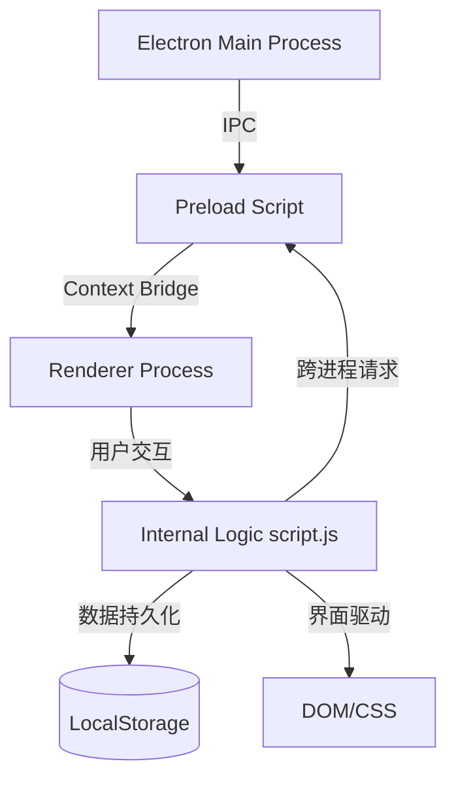

# 架构设计文档 (Architecture Design)

**项目名称**: FlexTimer v12
**架构类型**: 基于 Electron 的单页面应用程序 (SPA)
**核心理念**: 极致简约、数据驱动、响应式交互

---

## 1. 总体架构 (System Architecture)

FlexTimer v12 采用经典的 **Electron + Web前端** 架构。前端利用 Vanilla JavaScript 实现高性能运行，后端（主进程）负责原生系统集成。

### 1.1 系统流转图



### 1.2 目录结构

```text
FlexTimer-v12/
├── main.js              # 主进程：窗口管理、原生 API 调用
├── preload.js           # 预加载：Bridge 接口定义
├── index.html           # 视图层 (HTML5)
├── css/
│   └── style.css        # 视觉表现 (CSS3 + 玻璃拟态)
├── js/
│   └── script.js        # 核心逻辑 (ES6+ Vanilla JS)
└── doc/                 # 离线文档集
```

## 2. 核心模块分解

### 2.1 状态管理与持久化 (Model)
应用状态完全通过数据驱动。核心数据对象存储在 `localStorage` 中：
- `agendas`: 当前会议项列表。
- `historyData`: 按日期归档的历史数据。
- `settings`: 个性化配置（字体、颜色、透明度）。

### 2.2 计时核心引擎 (Timer Engine)
计时模块通过循环触发：
- **精确度控制**：利用递归 `setTimeout` 或 `setInterval` 配合系统时钟校验，确保计时准确。
- **状态机**：
  - `READY`: 准备阶段（显示 3-2-1）。
  - `RUNNING`: 正常扣减时间。
  - `OVERTIME`: 倒计时归零后自动进入正计时（负数显示）。

### 2.3 UI 渲染系统 (View)
- **玻璃拟态实现**：通过 `backdrop-filter: blur()` 与 `rgba` 渐变叠加实现。
- **同步机制 `syncUI()`**：每次数据变更后，此函数负责重新生成 DOM 节点。这种响应式设计虽然不使用 React，但保证了逻辑与视图的高度同步。

## 3. 关键集成技术

### 3.1 跨进程通信 (IPC)
通过 `preload.js` 暴露安全的 API 接口：
- `electron.setOpacity(val)`: 动态调节窗口不透明度。
- `electron.closeWindow()`: 处理定制化的关闭逻辑。

### 3.2 第三方集成
- **Sortable.js**: 仅用于拖拽排序逻辑，保持项目的轻量化。

## 4. 安全与性能
- **Context Isolation**: 启用 Electron 的上下文隔离，防止渲染进程直接访问 Node.js 高危接口。
- **资源占用**: 由于采用原生 JS 且无重型框架，冷启动速度极快，内存占用维持在 100MB 以内。
