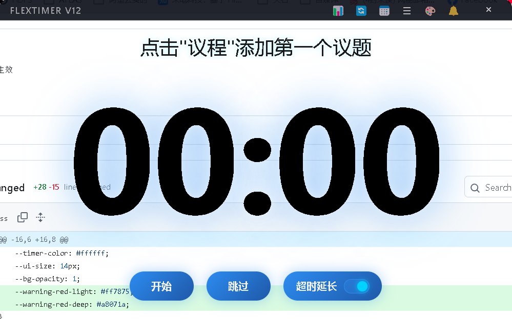
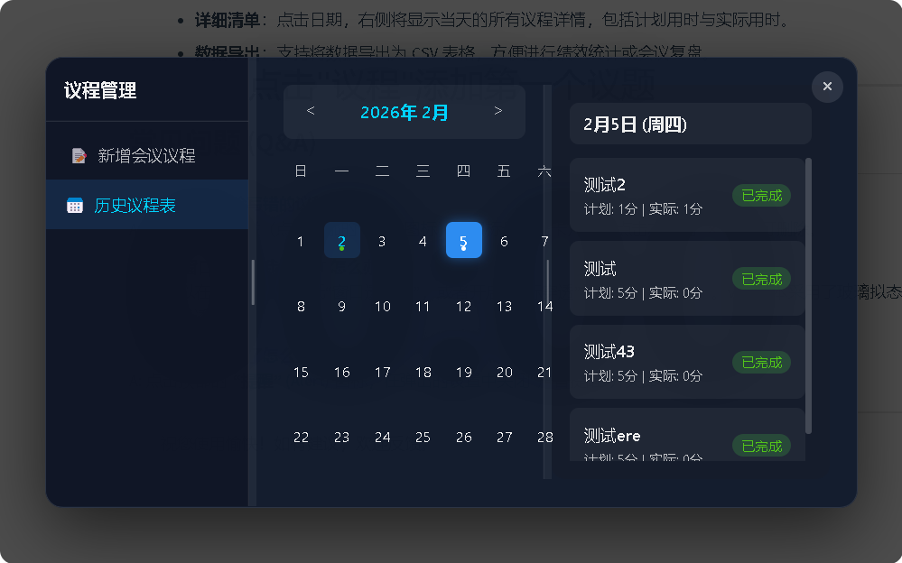
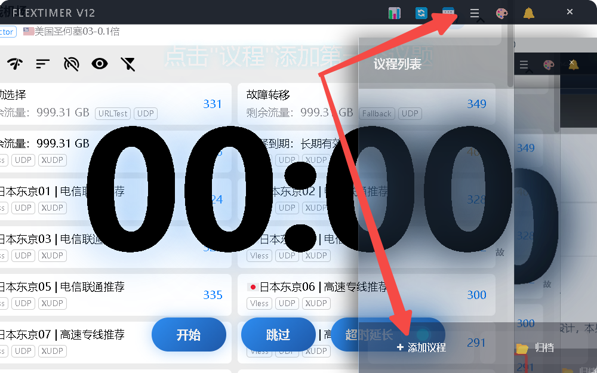
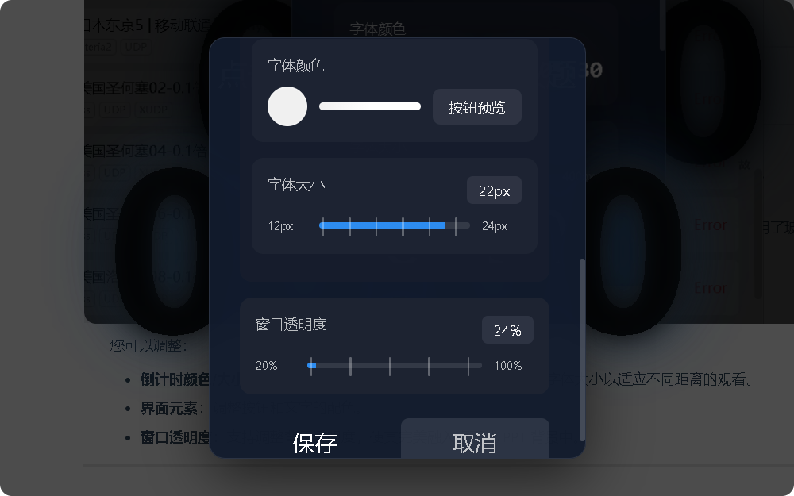

# FlexTimer用户使用手册 📖

欢迎使用 **FlexTimer v12** —— 您的专业会议与演示时间管理助手。本手册将带您快速上手，轻松掌握这款高颜值、强功能的计时工具。支持是否鼠标悬浮仅仅显示倒计时时间

---

## 1. 快速开始 🚀

双击运行.\dist\win-unpacked下的 `FlexTimerV12.exe`，您将看到如下主界面：

**鼠标悬浮：**

**移开鼠标：**

界面设计简洁直观，主要包含三个区域：

1. **顶部控制栏**：包含复盘、重置、管理、列表、外观、提醒等功能入口。
2. **中心计时区**：显示当前剩余时间和正在进行的议程标题。
3. **底部操作栏**：包含开始、跳过按钮以及超时延长开关。
4. **右侧列表**（默认折叠）：显示所有待进行的议程流水线。

---

## 2. 议程管理 📅

点击顶部菜单栏的 **“管理” (Manage)** 图标，打开议程管理中心。这里有新增议程和历史日历议程

## 3. 议程列表

1. **议题名称**：在输入框中填入会议环节名称（例如：项目介绍、Q&A环节）。

2. **计划时长**：设置该环节预计需要的时间（单位：分钟）。

3. **点击“开始议程”**：该议程将立即加入到主界面的待办列表中。

   **方式一：**

   

   **方式二**：

> 💡 **小贴士**：您可以一次性添加多个议程，它们会自动排队。

---

## 4.开始计时 ⏱️

当您准备好后，点击主界面底部的 **“开始” (Start)** 按钮。

- 倒计时**：系统会先展示一个全屏的 3 秒倒数动画，帮助演讲者调整呼吸，进入状态。
- **计时进行中**：屏幕中央的数字开始倒数。

### 特殊状态：超时预警 ⚠️

当剩余时间不足（例如最后 10 秒）或已经超时时，计时器会变红，并带有醒目的视觉提示，提醒演讲者注意时间。

- **超时记录**：如果时间归零后仍未结束，系统会自动进入负计时（例如 `-00:30`），精确记录超时时长。
- **自动跳过**：如果您关闭了底部的“超时延长”开关，时间一到将自动进入下一个议程。

---

## 5. 个性化设置 🎨

点击顶部菜单栏的 **“外观” (Appearance)** 图标，定制您的专属计时器。

您可以调整：

- **倒计时颜色/大小**：选择您喜欢的颜色（如绿色、白色），或调整字体大小以适应不同距离的观看。
- **界面元素**：调整按钮和文字的配色。
- **窗口透明度**：支持调整背景透明度，使其完美融入桌面或 PPT 背景中。

---

## 6. 复盘 📊

1、会议结束后，点击 **“复盘”** -> **“导出本次会议的议程情况”** 

2、历史议程管理：**日历视图**

- **日历视图**：左侧日历上带有蓝色标记的日期表示有会议记录。
- **详细清单**：点击日期，右侧将显示当天的所有议程详情，包括计划用时与实际用时。
- **数据导出**：支持将数据导出为 CSV 表格，方便进行绩效统计或会议复盘。

## 7.  提醒设置

点击顶部的 **“提醒” (Alert)** 图标，在弹出的设置中关闭“声音提醒”开关即可。

## 常见问题 (Q&A)

**Q: 如何删除写错的议程？**
A: 打开右侧侧边栏（点击顶部的“列表”图标），鼠标悬停在卡片上，点击右侧的 `×` 号即可删除。

**Q: 窗口挡住了我的 PPT 怎么办？**
A: 您可以在外观设置中降低“窗口透明度”，或者开启“鼠标穿透”模式。v12 版本采用了玻璃拟态设计，本身就具有很好的通透性。

**Q: 声音太吵了怎么关？**
A: 点击顶部的 **“提醒” (Alert)** 图标，在弹出的设置中关闭“声音提醒”开关即可。

